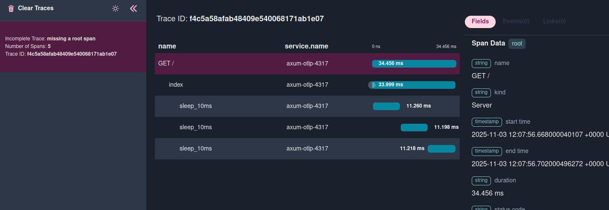

# axum-tracing-opentelemetry

[](http://creativecommons.org/publicdomain/zero/1.0/)
[](https://crates.io/crates/axum-tracing-opentelemetry)

[](https://www.repostatus.org/#active)

Middlewares to integrate axum + tracing + opentelemetry.

- Read OpenTelemetry header from incoming request
- Start a new trace if no trace found in the incoming request
- Trace is attached into tracing'span
- OpenTelemetry Span is created on close of the tracing's span (behavior from [tracing-opentelemetry])

For examples, you can look at the [examples](https://github.com/davidB/tracing-opentelemetry-instrumentation-sdk/tree/main/examples/) folder.

```txt
//...
use axum_tracing_opentelemetry::middleware::{OtelAxumLayer, OtelInResponseLayer};

#[tokio::main]
async fn main() -> Result<(), axum::BoxError> {
    // very opinionated init of tracing, look as is source to make your own
    let _guard = init_tracing_opentelemetry::TracingConfig::production().init_subscriber()?;

    let app = app();
    // run it
    let addr = &"0.0.0.0:3000".parse::<SocketAddr>()?;
    tracing::warn!("listening on {}", addr);
    let listener = tokio::net::TcpListener::bind(addr).await?;
    axum::serve(listener, app.into_make_service()).await?;
    Ok(())
}

fn app() -> Router {
    Router::new()
        .route("/", get(index)) // request processed inside span
        // include trace context as header into the response
        .layer(OtelInResponseLayer::default())
        //start OpenTelemetry trace on incoming request
        .layer(OtelAxumLayer::default())
        .route("/health", get(health)) // request processed without span / trace
}
```

For more info about how to initialize, you can look at crate [`init-tracing-opentelemetry`] or [`tracing-opentelemetry`].



## Differences with `tower_http::trace`

[`tower_http::trace`](https://docs.rs/tower-http/latest/tower_http/trace/index.html) is a general-purpose logging middleware: it emits `tracing` events for request/response lifecycle (start, end, failure) and lets you customize the span fields yourself.

`axum-tracing-opentelemetry` is focused on OpenTelemetry distributed tracing instead:

- Extracts the `OTel` trace context (W3C `traceparent`/`tracestate` headers) from the incoming request and makes it the parent of the request's span, so traces connect across services. (No B3 support.)
- Populates the span with [OTel HTTP semantic convention] attributes (`http.request.method`, `url.path`, `server.address`, ...) instead of arbitrary custom fields.
- Optionally injects the trace context back into the response headers (`OtelInResponseLayer`), so the `trace_id` is available to clients — handy to surface in error messages (API or human-facing) for support/debugging. This is *not* the same as `tower_http`'s `X-Request-Id` (from its separate `request_id` module, not `trace`): ours is the actual `OTel` trace id, correlated with your backend traces.
- Does not log request/response bodies or emit per-phase log events — combine it with `tower_http::trace` (or your own logging) if you need that.

Use `tower_http::trace` for human-readable request logging, and `OtelAxumLayer` for `OTel` trace propagation/correlation. They are complementary and can be layered together.

See [issue #158](https://github.com/davidB/tracing-opentelemetry-instrumentation-sdk/issues/158) for more background and discussion.

[OTel HTTP semantic convention]: https://opentelemetry.io/docs/specs/semconv/http/http-spans/

## Metrics endpoint

Enable the `metrics-prometheus` feature to get `prometheus_metrics::router`, which mounts a `GET /metrics` route serving a Prometheus [`Registry`](https://docs.rs/prometheus/latest/prometheus/struct.Registry.html) in text format:

```txt
let app = Router::new()
    .merge(axum_tracing_opentelemetry::prometheus_metrics::router(registry))
    .route("/", get(index));
```

See [`init-tracing-opentelemetry`]'s "Metrics" section for how to build `registry` via `TracingConfig::with_metrics_prometheus()`, and the [`axum-prometheus` example](../examples/axum-prometheus).

## Changelog - History

[CHANGELOG.md](https://github.com/davidB/tracing-opentelemetry-instrumentation-sdk/blob/main/CHANGELOG.md)

[`tracing-opentelemetry`]: https://crates.io/crates/tracing-opentelemetry
[`init-tracing-opentelemetry`]: https://crates.io/crates/init-tracing-opentelemetry
